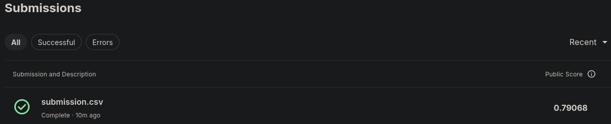

# Trabalho para a disciplina de Reconhecimento de Padrões do curso de mestrado no IFES

## Jupyter notebook
O arquivo nlp_disaster_tweets.ipynb é um jupyter notebook com o código fonte que gerou a submissão para o Kaggle.

## Submission
A submissão gerou um score de 0.79068

